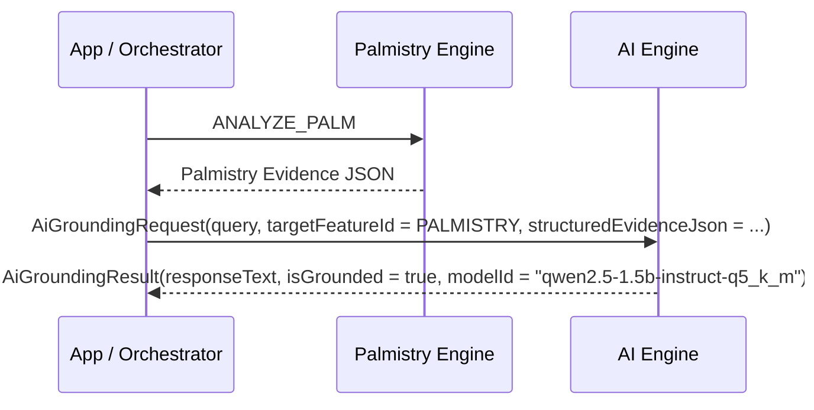

# AYNVORA AI Engine Architecture

## Architectural Isolation
The AI Engine (`engines/ai-engine/`) operates independently of domain calculation algorithms:
- It **does not import** `astro-engine`, `palmistry-engine`, or other feature code.
- It receives structured evidence contracts and events from features.
- It invokes the local on-device SLM runtime using `qwen2.5-1.5b-instruct-q5_k_m.gguf`.

## Operational Invariants
- **Model Modifications**: NONE. Production model `qwen2.5-1.5b-instruct-q5_k_m.gguf` remains strictly unchanged.
- **Fine-Tuning**: `FINE_TUNING = TRAINING_PREPARED`. No training or weights modification is permitted.
- **Evidence-First Grounding**: AI responses must ground on structured evidence passed through contracts to prevent hallucinations.

## Flow

