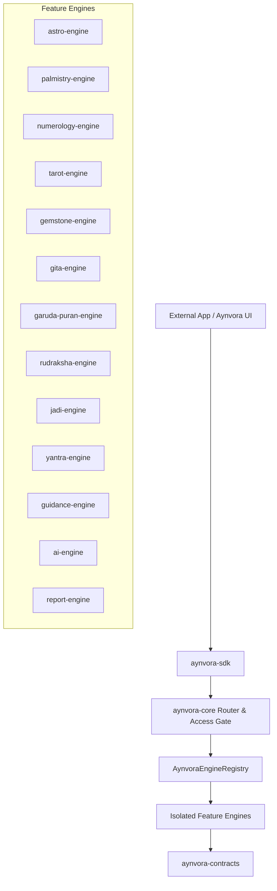

# AYNVORA Modular SDK Platform Architecture

## Executive Summary
AYNVORA is rearchitected as an **engine-first, modular Kotlin Multiplatform SDK platform**.
Every capability is isolated in an independent engine module that communicates strictly through canonical JSON events and typed contracts.

## Module Ownership & Responsibilities

| Module | Location | Responsibility | Disallowed Dependencies |
|---|---|---|---|
| `:aynvora-contracts` | `aynvora-contracts/` | Canonical event schemas, feature tokens, shared astronomical enums (`CelestialBody`, `Rashi`), result types | UI, Compose, Engines, Platform SDKs |
| `:astro-engine` | `astro-engine/` | Planetary positions, Vargas, Shadbala, Ashtakavarga, Dasha, Panchanga, Tajika | UI, Palmistry, AI, Core |
| `:palmistry-engine` | `engines/palmistry-engine/` | Hand detection, landmarks, palm lines, evidence extraction, quality checks | UI, CameraX, Compose, Other engines |
| `:numerology-engine` | `engines/numerology-engine/` | Chaldean, Pythagorean, Indian, Lo Shu, Katapayadi, Abjad | UI, Astrology, Other engines |
| `:tarot-engine` | `engines/tarot-engine/` | 78-card deck catalog, spreads, seedable RNG draws | UI, Compose, Other engines |
| `:gemstone-engine` | `engines/gemstone-engine/` | Vedic ratna recommendations, uparatna, planetary alignments | UI, Palmistry, Other engines |
| `:gita-engine` | `engines/gita-engine/` | Canonical Bhagavad Gita verses, translations, commentary references | UI, Compose |
| `:garuda-puran-engine` | `engines/garuda-puran-engine/` | Validated Garuda Puran verses, afterlife karma doctrine retrieval | UI, Compose |
| `:rudraksha-engine` | `engines/rudraksha-engine/` | 1-21 Mukhi bead knowledge, ruling deities, planetary mappings | UI, Compose |
| `:jadi-engine` | `engines/jadi-engine/` | Ayurvedic herbal root correspondences | UI, Compose |
| `:yantra-engine` | `engines/yantra-engine/` | Sacred geometric yantra configurations | UI, Rendering code, Compose |
| `:guidance-engine` | `engines/guidance-engine/` | Daily guidance synthesis, Panchanga-derived recommendations | UI, Compose |
| `:ai-engine` | `engines/ai-engine/` | On-device Qwen2.5 inference, structured evidence grounding, zero hallucination | Direct engine imports, UI |
| `:report-engine` | `engines/report-engine/` | Multi-feature composite reports, PDF document generation | Domain calculations, UI |
| `:aynvora-core` | `aynvora-core/` | Transaction routing, engine registry, feature access gating, analytics bridge | Feature business calculations |
| `:aynvora-sdk` | `aynvora-sdk/` | Public facade with Mode A (Typed) and Mode B (Raw Event JSON) | Compose, Android UI |
| `:ui` | `ui/` | Optional presentation layer consuming SDK models and localized strings | Engine implementations |

## Architectural Invariants
1. **Engine Independence**: Engines never import each other (`astro-engine` does NOT depend on `palmistry-engine`).
2. **Headless Execution**: Entire SDK is operable in headless mode (XML, Flutter, React Native, Desktop CLI, Server JVM).
3. **Canonical Transport**: Transport between Core and Engines is JSON-first.
4. **Presentation Separation**: Engines output language-neutral tokens (`RIGHT_HAND`, `HEART_LINE`, `SUCCESS`). Localization is presentation-only.
5. **No Calculations in UI or Core**: Core is strictly orchestration; UI is strictly rendering.
