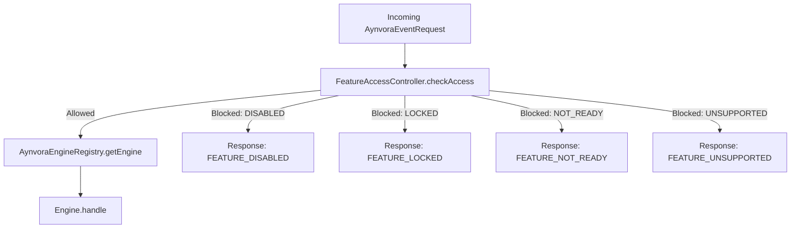

# AYNVORA Feature Access and Locking System

## Access Control Philosophy

AYNVORA allows granular, runtime gating of feature engines via `AynvoraFeatureSettings` and `FeatureAccessController`.
A disabled feature engine remains present in the compiled binary or package, but the core event router immediately intercepts calls before any execution or memory allocation occurs.

## Feature Access States

```kotlin
enum class FeatureAccessState {
    ENABLED,        // Ready and operational
    DISABLED,       // Explicitly deactivated by host application or user preferences
    LOCKED,         // Premium tier gate / requires license or entitlement
    NOT_READY,      // Domain contracts defined; full algorithms not yet active
    RESEARCH_ONLY,  // Experimental algorithm under validation
    UNSUPPORTED,    // Hardware or profile cannot support (e.g. GPU unavailable)
}
```

## Router Interception Flow



## Data Persistence Guarantee
Toggling feature access states does **never delete historical or saved user data**.
All saved kundalis, palm scans, readings, and reports remain safely cached in the persistence layer (`:aynvora-data`).
