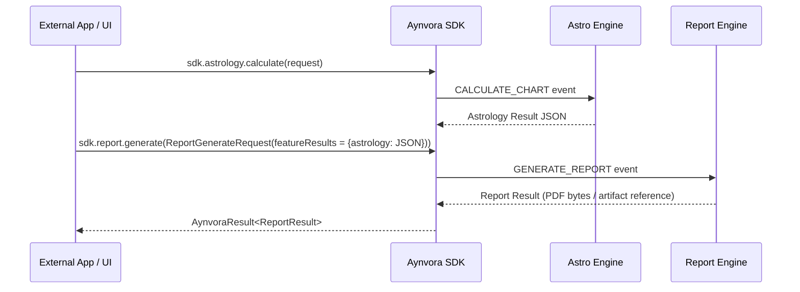

# AYNVORA Report Engine Architecture

## Architectural Isolation
The Report Engine (`engines/report-engine/`) is completely separated from feature engines:
- It **does not calculate** astrology charts, palm landmarks, tarot spreads, or numerology cycles.
- It receives pre-calculated feature JSON outputs and aggregates them into structured, beautiful reports (PDF / HTML / exportable formats).

## Generation Flow



## Report Request Contract

```kotlin
@Serializable
data class ReportGenerateRequest(
    val reportType: String, // e.g. "KUNDALI_COMPREHENSIVE", "PALMISTRY_INSIGHT"
    val subjectName: String,
    val featureResults: Map<String, String> = emptyMap(), // Keyed by feature token
    val requestedSections: List<String> = emptyList(),
    val languageCode: String = "en",
)
```
