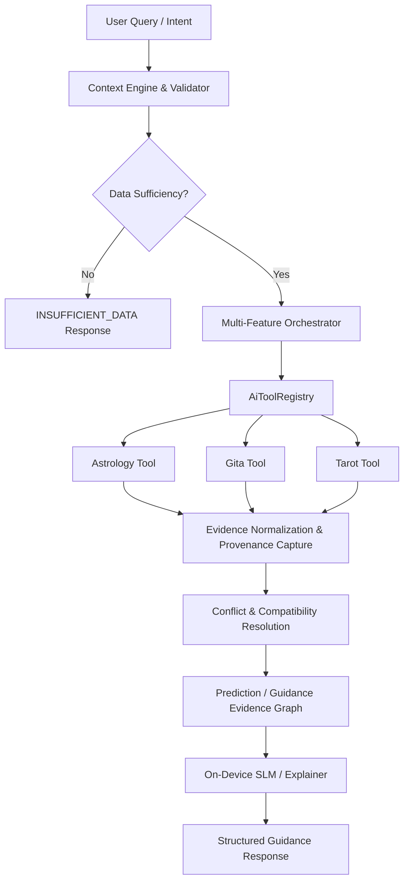

# CORE INTELLIGENCE ARCHITECTURE — AYNVORA PLATFORM

## 1. Overview & Architectural Principles

AYNVORA operates as a **Personal Astro OS** supporting 10 first-class core product domains:

1. Astrology
2. Palmistry / Hastrekha
3. Gemstone / Ratna
4. Bhagavad Gita
5. Garuda Puran
6. Lal Kitab
7. Tarot
8. On-Device AI / SLM
9. Daily Guidance & Practice
10. Personalized Wallpaper Studio

To maintain clean architectural boundaries and prevent exponential coupling, AYNVORA enforces two
foundational concepts:

### A. Independent Feature Domain

Every core feature domain is built as a self-contained, offline-first component that can be used
independently without requiring any other feature.

- Astrology calculates natal charts, divisional vargas, and strengths without Tarot or Gemstones.
- Tarot performs contemplative card draws and spreads without Astrology or birth data.
- Gita verse search operates without any birth profile or astrology engine.
- Wallpaper prompt construction formats device dimensions and astrological tokens without calling
  Palmistry or cloud AI.

### B. Cross-Feature Orchestration

When a user query or workflow requires multi-domain analysis (e.g. "Synthesize an astrological
timing window with a relevant Gita ethical reflection"), features **never** call one another's
internal implementations or repositories directly.
Instead, requests flow through the dedicated orchestration layer:
`com.aynvora.core.intelligence.MultiFeatureOrchestrator`

---

## 2. Evidence Graph & Categorization

All outputs generated across domains are normalized into structured `EvidenceItem` instances:

- `FACT`: Concrete mathematical calculations (e.g., Lagna degrees, planetary sidereal longitudes,
  house cusps).
- `DERIVED_FACT`: Multi-step derived metrics (e.g., Shadbala rupas, Sarvashtakavarga bindu counts,
  Shodhana reductions).
- `TRADITIONAL_RULE`: Verified textual shlokas or classical principles (e.g., Gita 2.47 Nishkama
  Karma, Parashara house ownership rules).
- `INTERPRETATION`: Archetypal or symbolic reflections (e.g., Tarot card meanings, psychological
  archetypes).
- `USER_CONTEXT`: Verified local user inputs (e.g., active gemstones worn, selected life goals,
  birth location).

### Deterministic Traceability ("Why did this appear?")

Every synthesized insight links back to source evidence nodes via `EvidenceGraphEdge`. An answer
to "Why did this recommendation appear?" walks back through:
`Observed Lagna/Graha` $\rightarrow$ `Dasha/Transit condition` $\rightarrow$
`Classical Rule` $\rightarrow$ `Synthesized Interpretation`
Fabrication after generation is structurally prevented.

---

## 3. Conflict Resolution & Tradition Separation

AYNVORA supports multiple classical traditions (e.g. `PARASHARA_CLASSICAL_V1`,
`LAL_KITAB_CLASSICAL`, `TAROT_CONTEMPLATIVE`, `GITA_VEDANTA`).
Traditions are never silently merged or averaged.

- When multiple traditions evaluate the same chart placement, divergent mechanics (such as Lal Kitab
  fixed-house lordship vs Parashara dynamic sign lordships) are flagged as `MODIFIER` or
  `CONTRADICTING`.
- The system returns `GuidanceStatus.CONFLICTING_RULES` and explicitly details both viewpoints to
  the user.
- Contradictory evidence is **preserved**, never suppressed to fabricate artificial harmony.

---

## 4. Data Sufficiency & Anti-Hallucination

Before calculating domain facts, the `DataSufficiencyValidator` inspects the request:

- If a user requests an astrological analysis or Lal Kitab evaluation but birth date, birth time,
  latitude, longitude, or timezone is missing, the orchestrator immediately returns
  `GuidanceStatus.INSUFFICIENT_DATA`.
- Default values or "hallucinated fallbacks" are forbidden.

---

## 5. On-Device AI / SLM Boundaries

The on-device SLM (Small Language Model) serves as an **orchestration assistant and natural language
explainer**, NOT a source of truth:

1. **No Direct Database Access**: The SLM is forbidden from accessing Room database DAOs or Firebase
   directly.
2. **Typed Tools Only**: The SLM must call approved domain tools (`AiTool`) via
   `DefaultAiToolRegistry`.
3. **No Calculation Authority**: The SLM cannot calculate degrees, aspects, Vargas, Tithis, or
   gemstone carats.
4. **Offline Operation**: Runs entirely on-device without mandatory network connectivity.
