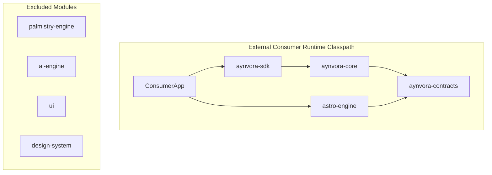

# AYNVORA Dependency Model & Isolation Architecture

This document formalizes the strict dependency model of the AYNVORA SDK ecosystem, established in Phase 10.46.

---

## 1. Principles of Modular Isolation

1. **Feature Decoupling**: No engine module ever imports another engine module. `astro-engine` has zero knowledge of `palmistry-engine`.
2. **Headless Separation**: Feature engines are headless calculation units. They contain ZERO UI, Compose, or Android View dependencies.
3. **Core Dependency Rules**:
   - `aynvora-contracts` contains data models, event definitions, statuses, and interfaces.
   - `aynvora-core` coordinates engine routing, feature access control, and analytics. It has `compileOnly` dependencies on optional feature engine providers where needed for type verification, ensuring ZERO runtime leakage to consumers.
   - `aynvora-sdk` is the facade providing both strongly-typed adapters (`sdk.astrology`, `sdk.palmistry`) and raw event dispatch (`sdk.dispatch(...)`).
4. **Third-Party Boundary Rules**:
   - Engines never import Firebase, Google Play Services, or proprietary SDKs.
   - All analytics, logging, and metrics flow through the contracts' ports.

---

## 2. Dependency Graph

---

## 3. Resolving the `compileOnly` Runtime Decoupling

In earlier versions, if an SDK or Core module held an `api(...)` reference to an engine, that engine was automatically forced onto every consumer's classpath.

In Phase 10.46:
1. `aynvora-core` references engine providers via `compileOnly(project(":astro-engine"))`.
2. When an external consumer imports `aynvora-sdk` + `palmistry-engine`, the runtime classpath contains strictly `palmistry-engine`. `astro-engine` is completely absent.
3. If the consumer dispatches an event for a feature whose engine was not registered, the router returns `AynvoraStatus.FEATURE_NOT_INCLUDED`.
4. No `ClassNotFoundException`, `NoClassDefFoundError`, or reflection crash can occur.
