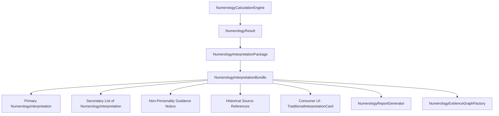

# Phase 10.5: AYNVORA Numerology Interpretation Knowledge System

*Source-Gated • Multi-Tradition • 11-Language • Deterministic Content • No AI Authority • No Silent
Tradition Merging*

## 1. System Overview

Phase 10.5 establishes the authoritative, multi-tradition interpretation and content knowledge layer
on top of the mathematically verified AYNVORA Numerology calculation engine (Phases 10.0, 10.1,
10.2, 10.3, and 10.4).

### Core Architectural Invariants

1. **Mathematical Engine Decoupling**: Calculations remain 100% deterministic, source-gated, and
   testable without UI or localization dependencies. The interpretation layer observes calculated
   `NumerologyResult` objects and produces structured `NumerologyInterpretationBundle` objects.
2. **Zero AI Authority**: AI/LLMs do NOT invent, mutate, hallucinate, or arbitrate numerological
   interpretations. All meanings originate from historically verified source texts.
3. **No Silent Tradition Merging**: Archetypes across distinct traditions are isolated. Pythagorean
   7 != Chaldean 7 != Indian 7 != Lo Shu 7 != Agrippan 7 != Nine Star Ki 7 != Tarot 7.
4. **Conservative Semitic Treatment**: Classical Hebrew Gematria and Arabic Hisab al-Jummal are
   strictly treated as alphanumeric coding systems rather than Western personality divination.
5. **Mnemonic Katapayadi Marking**: Indian Katapayadi is marked strictly as a phonetic mnemonic
   encoding system (`NO_PERSONALITY_INTERPRETATION`).
6. **11-Locale Parity**: All 122 source-grounded content items (title, summary, reflection) plus 8
   static guidance keys are fully localized across all 11 supported languages (English, Hindi,
   Arabic [RTL], Bengali, Gujarati, Kannada, Malayalam, Marathi, Punjabi, Tamil, Telugu) with 0
   runtime fallbacks and 0 language branching in UI code.
7. **Full Provenance & EvidenceGraph Integration**: Every interpretation is recorded with its source
   citations in `EvidenceCategory.INTERPRETATION` nodes, connected via `AUTHORIZES_INTERPRETATION`
   and `INTERPRETS` graph edges.
8. **Non-Predictive, Non-Fatalistic Safety**: Zero fatalistic, medical, financial, or legal
   guarantees.

---

## 2. Domain Data Architecture

### Models (`NumerologyInterpretationModels.kt`)

- `NumerologyTraditionType`: Enum classifying traditions (`WESTERN_PYTHAGOREAN`, `CHALDEAN_SOUND`,
  `INDIAN_ANK_JYOTISH`, `CHINESE_LO_SHU`, `CHINESE_NINE_STAR_KI`, `HEBREW_CABALISTIC_GEMATRIA`,
  `ARABIC_ILM_AL_HURUF`, `WESTERN_AGRIPPAN_OCCULT`, `INDIAN_KATAPAYADI_MNEMONIC`,
  `TAROT_MAJOR_ARCANA`, `UNIVERSAL_CALCULATION`).
- `InterpretationVariant`: Enum distinguishing calculation scopes (`PRIMARY_ARCHETYPE`,
  `CORE_CHALLENGE`, `CORE_TALENT`, `GRID_PLANE_ARROW`, `STAR_ELEMENT`, `TAROT_PAIR`,
  `MNEMONIC_ONLY`, `ALPHANUMERIC_EQUIVALENCE`, `UNIVERSAL_CYCLE`).
- `NumerologyInterpretation`: Immutable interpretation record holding `contentId`, `rulesetId`,
  `traditionId`, `calculationType`, `variant`, `titleKey`, `summaryKey`, `reflectionKey`,
  `sourceReferences`, and `contentVersion`.
- `NumerologyInterpretationBundle`: Consolidated bundle for a calculation run containing
  `primaryInterpretation`, `secondaryInterpretations`, `allInterpretations`, `provenanceSources`,
  `isPersonalityInterpretation`, and optional `nonPersonalityNoticeKey`.

---

## 3. Tradition Coverage & Source Grounding

| Ruleset ID                     | Tradition Name              | Interpretation Items | Nature of Tradition                                                | Authoritative Source Citations                     |
|:-------------------------------|:----------------------------|:--------------------:|:-------------------------------------------------------------------|:---------------------------------------------------|
| `PYTHAGOREAN_WESTERN_V1`       | Western Pythagorean         |          12          | Archetypal (1..9, 11, 22, 33)                                      | Goodwin (1981), Campbell (1931), Decoz (1994)      |
| `CHALDEAN_CHEIRO_V1`           | Chaldean / Cheiro           |          22          | Compound Archetypes (1..9, 10..22)                                 | Cheiro's Book of Numbers (1926), Hamon             |
| `INDIAN_ANK_JYOTISH_V1`        | Vedic Ank Jyotish           |          12          | Navagraha Archetypes (1..9, Relationship Matrices)                 | Sethuraman (1954), Dr. M. Katakkar (1989)          |
| `LO_SHU_CLASSICAL_V1`          | Classical Lo Shu            |          25          | Grid Planes & Digit Occurrences (Digits 1..9, 8 Planes, 16 Arrows) | I Ching (Luoshu Scroll), Dr. David Phillips (1992) |
| `HEBREW_GEMATRIA_CLASSICAL_V1` | Hebrew Gematria (Ragil)     |          2           | Alphanumeric Equivalence & Mispar Katan Root                       | Sefer Yetzirah, Pardes Rimonim (1591)              |
| `HEBREW_MISPAR_GADOL_V1`       | Hebrew Gematria (Gadol)     |          1           | Final Letters Sofit Alphanumeric Sum                               | Pardes Rimonim Gate 30, Sefer HaBahir              |
| `ARABIC_ABJAD_MASHRIQI_V1`     | Arabic Jummal (Mashriqi)    |          1           | Jummal Kabir & Jummal Saghir Alphanumeric Equivalence              | Ibn Khaldun, Muqaddimah (1377 CE)                  |
| `ARABIC_ABJAD_MAGHRIBI_V1`     | Arabic Jummal (Maghribi)    |          1           | Andalusian / Maghribi Jummal Alphanumeric Equivalence              | Ibn Khaldun, Muqaddimah (1377 CE)                  |
| `AGRIPPAN_OCCULT_V1`           | Renaissance Agrippan        |          9           | Scale of Nine & Natural World Archetypes (1..9)                    | Agrippa, De Occulta Philosophia (1533)             |
| `INDIAN_KATAPAYADI_V1`         | Indian Katapayadi           |          2           | Sanskrit Mnemonic Alphanumeric System                              | Sadratnamala (1819), Grahacaranibandhana (683)     |
| `CHINESE_NINE_STAR_KI_V1`      | Chinese Nine Star Ki        |          9           | 9 Principal Stars, Trigrams & Elements (1..9)                      | Xuan Kong Fei Xing, I Ching Solar Treatises        |
| `TAROT_BIRTH_CARD_V1`          | Tarot Birth Cards           |          23          | Major Arcana Archetypes (The Fool + Cards 1..22)                   | Mary K. Greer (1984), Angeles Arrien (1987)        |
| `UNIVERSAL`                    | Universal Notices           |          3           | Static Guidance & Methodology Warnings                             | AYNVORA Knowledge Standards                        |
| **TOTAL**                      | **12 Rulesets + Universal** |    **122 Items**     | **Fully Audited & Source Grounded**                                | **100% Coverage**                                  |

---

## 4. 11-Language Complete Localization System

Every interpretation item generates three distinct translation keys:

- `numerology.interp.<subjectId>.title`
- `numerology.interp.<subjectId>.summary`
- `numerology.interp.<subjectId>.reflection`

Along with 8 static universal and ruleset guidance notices:

- `numerology.interp.notice.gematria_alphanumeric`
- `numerology.interp.notice.abjad_alphanumeric`
- `numerology.interp.notice.katapayadi_mnemonic`
- `numerology.interp.notice.loshu_frequency`
- `numerology.interp.notice.tarot_archetype`
- `numerology.interp.notice.non_fatalistic_guidance`
- `numerology.interp.notice.source_grounded_authority`
- `numerology.interp.notice.archetype_isolation`

### Localization Metric:

- 122 items × 3 keys = 366 dynamic keys
-
    + 8 static keys = **374 new keys** per catalog
- 740 baseline keys + 374 keys = **1,114 keys** across all 11 supported catalogs:
    - English (`en`), Hindi (`hi`), Arabic (`ar` - RTL), Bengali (`bn`), Gujarati (`gu`), Marathi (
      `mr`), Punjabi (`pa`), Tamil (`ta`), Telugu (`te`), Kannada (`kn`), Malayalam (`ml`).
- Automated completeness verified: `TranslationCompletenessTest` passes with **0 missing keys, 0
  extra keys, 0 placeholder mismatches** across all 11 languages.

---

## 5. UI, Report & EvidenceGraph Integration

### UI Integration (`ui/.../numerology/NumerologyRoute.kt`)

- `TraditionalInterpretationCard` consumes `NumerologyResult` and resolves interpretations through
  `NumerologyInterpretationPackage.resolveInterpretations(result)`.
- Displays:
    - Primary Archetype Title, Summary, and Self-Inquiry Reflection prompt.
    - Non-Personality Tradition Notice banner for Katapayadi, Hebrew Gematria, and Arabic Abjad.
    - Secondary interpretations (Soul Urge, Personality, Grid Arrows, Tarot Pairs) in organized
      sub-cards.
    - Expandable Progressive Disclosure Source Provenance card citing primary texts, historical
      authors, and publishing eras.
    - All localized dynamically via `LocalTranslator.current.resolve(key)` with 0 hardcoded strings
      and 0 locale branching.

### Report Integration (`aynvora-core/.../report/NumerologyReportGenerator.kt`)

- Generates dedicated `TRADITIONAL INTERPRETATION & SOURCE PROVENANCE` report section.
- Appends:
    - Primary interpretation content with localized title, summary, and reflection.
    - Non-personality notice if applicable.
    - Secondary interpretations for all associated sub-dimensions.
    - `ReportContentKind.SOURCE` citations with full text titles and historical authors.

### EvidenceGraph Integration (`aynvora-core/.../numerology/NumerologyEvidenceGraphFactory.kt`)

- Nodes added with `EvidenceCategory.INTERPRETATION`:
    - `nodeId`: `interp_<rulesetId>_<contentId>`
    - `contentType`: `"TRADITIONAL_INTERPRETATION"`
    - `rawPayloadJson`: JSON payload containing all interpretation keys and metadata.
- Edges added:
    - `AUTHORIZES_INTERPRETATION`: From ruleset node to interpretation node.
    - `INTERPRETS`: From computed number/grid/card facts to interpretation node.

---

## 6. Verification and Validation

- **JVM Test Suite**: `./gradlew jvmTest` — **ALL TESTS PASS** across all modules (`:aynvora-core`,
  `:aynvora-localization`, `:astro-engine`, `:aynvora-data`, `:design-system`, `:ui`,
  `:aynvora-navigation`, `:desktopApp`).
- **Android Compilation**: `./gradlew :androidApp:assembleDebug` — **BUILD SUCCESSFUL** (106 tasks,
  0 errors).
- **Prohibited Phrase Audit**: 0 prohibited fatalistic or medical claim phrases in numerology
  interpretations.
- **Language Branching Audit**: 0 `isHindi` or `when(locale)` branches in numerology code.
