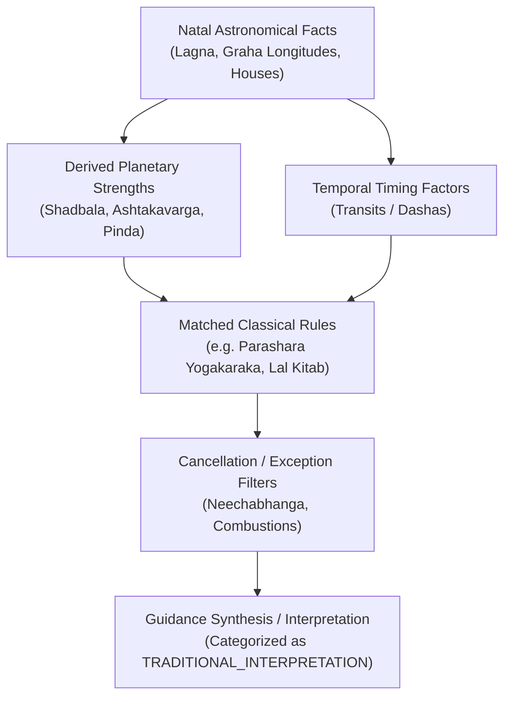

# PREDICTION & GUIDANCE EVIDENCE GRAPH SPECIFICATION

## 1. Overview

AYNVORA models all future-oriented astrological, contemplative, and life-guidance evaluations as an
**Evidence Graph**.
The system strictly rejects ungrounded generation. Every guidance output must be traceable back to
concrete astronomical calculations and classical rulesets.

---

## 2. Graph Node Hierarchy



---

## 3. Evidence Categories

1. **FACT**: Irreducible mathematical or observational data.
    - Example: *Chandra is at 18° 42' Mesha in Bharani Nakshatra.*
2. **DERIVED_FACT**: Deterministically computed secondary factors.
    - Example: *Brihaspati Shadbala is 1.35 Rupas (exceeds required strength threshold).*
3. **TRADITIONAL_RULE**: Explicit rules from classical texts.
    - Example: *Parashara BPHS Ch 34: Venus as 4th and 9th lord for Kumbha Lagna acts as
      Yogakaraka.*
4. **INTERPRETATION**: Contemplative reflections and contextual advice.
    - Example: *Tarot Major Arcana The Fool indicates an opportunity for mindful new beginnings.*
5. **USER_CONTEXT**: Verified self-reported user state.
    - Example: *User currently wears a 5.2 carat Yellow Sapphire (Pukhraj).*

---

## 4. Querying the Evidence Graph: `traceWhy`

The `EvidenceGraph` provides deterministic provenance inspection:

```kotlin
val contributors = evidenceGraph.traceWhy(targetGuidanceEvidenceId)
```

This returns all direct and indirect supporting evidence nodes, their source ruleset editions,
calculation versions, and timestamps.
If a user or auditor asks:
> *"Why did this timing guidance appear for career?"*

AYNVORA answers with:

- Exact planetary degrees and house cusps evaluated.
- Dasha/transit windows considered.
- Classical rule citations applied.
- Conflicting or modifying factors detected (e.g. Lal Kitab house divergence).

---

## 5. Ethical Governance: Prediction as Interpretation

In accordance with Master Rule 54:

- All future-looking outputs remain labeled as `TRADITIONAL_INTERPRETATION` or
  `FUTURE_TIMING_WINDOW`.
- Future predictions are **never** presented as guaranteed scientific facts.
- Health, medical, and legal claims are strictly prohibited.
